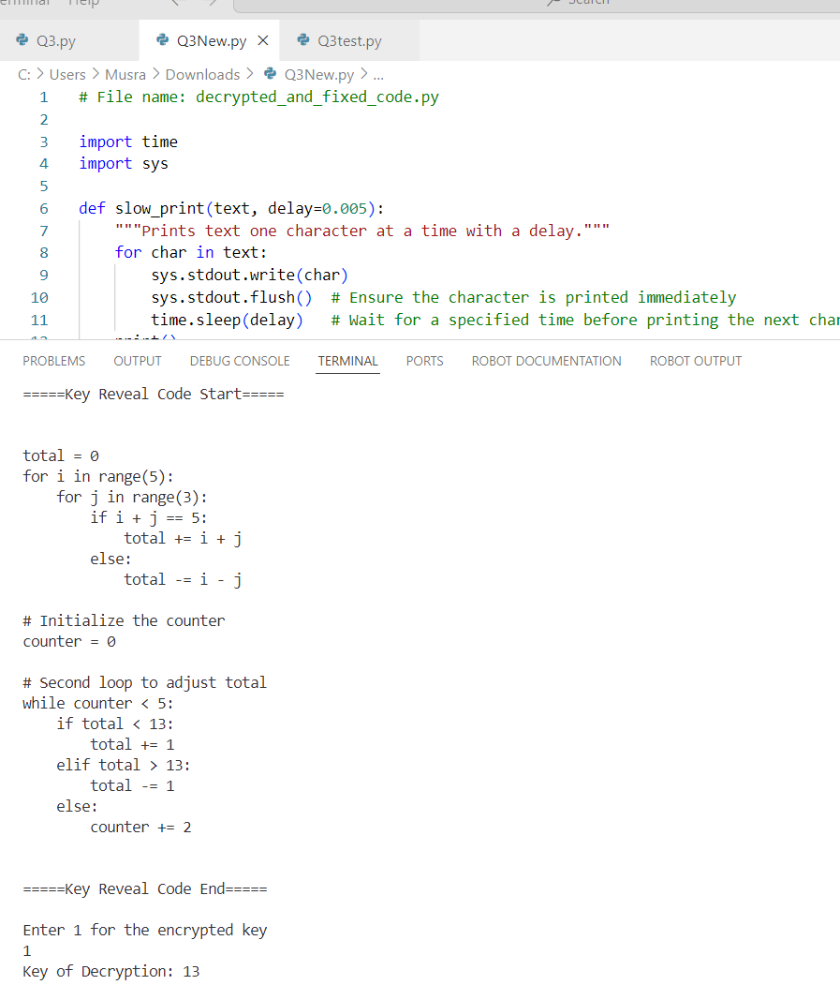
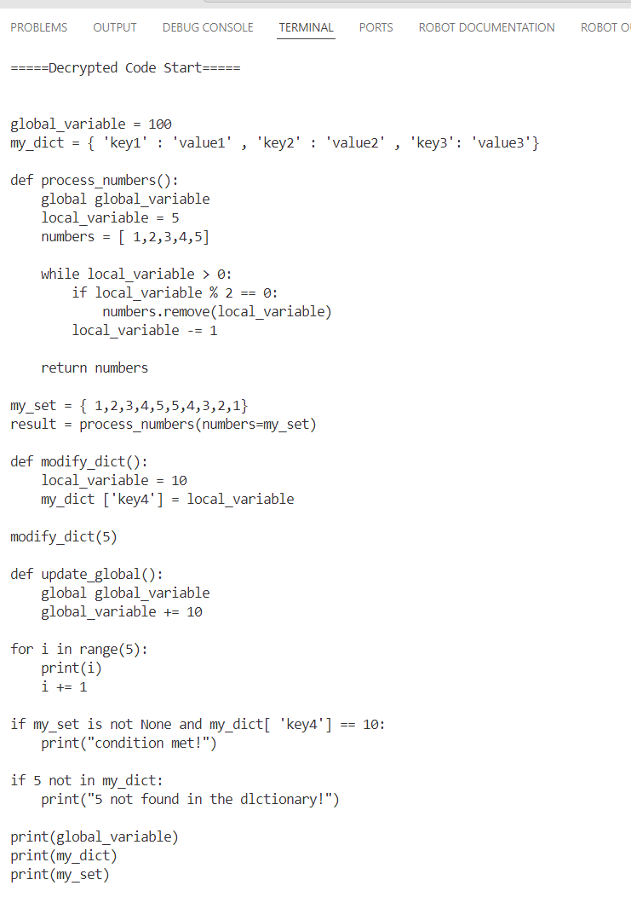
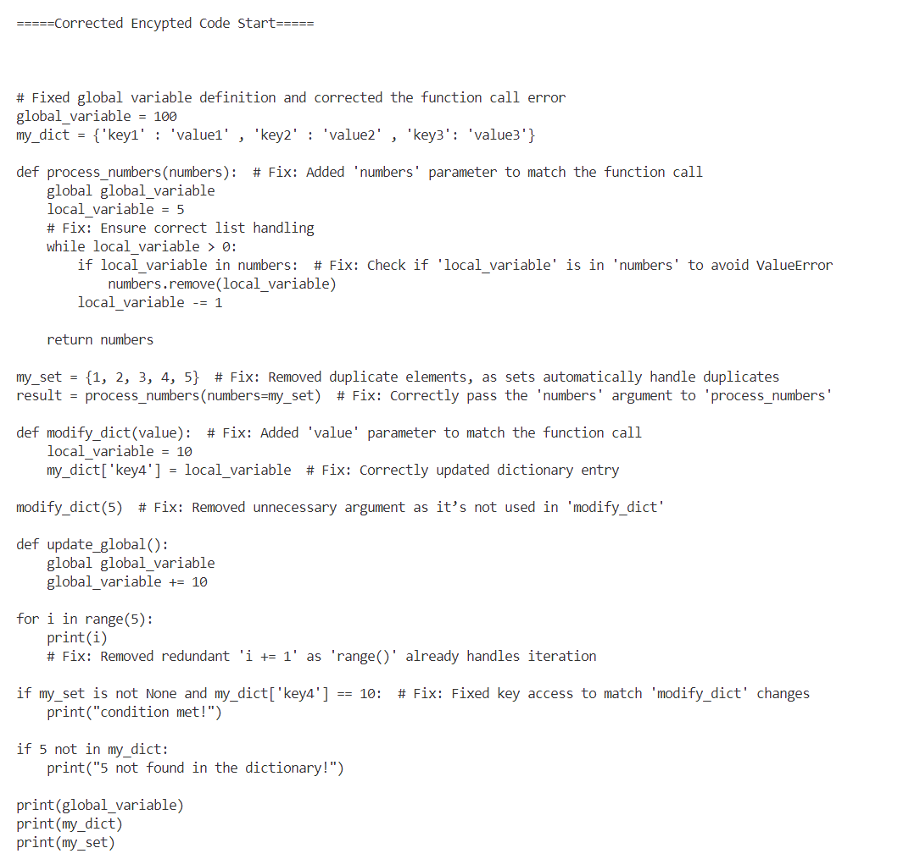
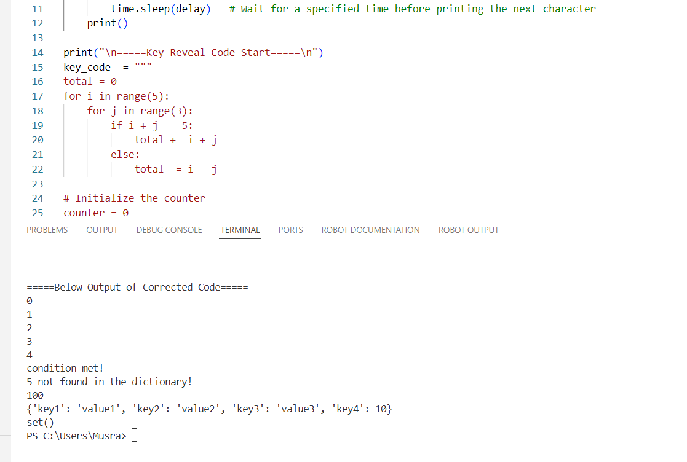

                                                                    Assignment 2 Report

# Introduction

This report covers the second assignment, which involves a mix of research, programming, and teamwork. The assignment includes tasks such as:

1. **Natural Language Processing (NLP)**: Using libraries like SpaCy and Hugging Face to analyze and extract information from text data.
2. **Image Manipulation**: Modifying an image based on specific instructions and summing pixel values.
3. **Error Correction and Decryption**: Fixing errors in encrypted code and explaining the corrections.
4. **Team Collaboration**: Using GitHub to manage and document group work.

---

## Question 1 : Natural Language Processing libraries

### Task 1: Extracting Text from CSV Files

The goal is to extract large amounts of text data from multiple CSV files. Each file contains a designated column with 'large texts,' which are to be consolidated into a single `.txt` file for further analysis.

**Steps:**
1. Read each CSV file.
2. Extract the text column.
3. Write the text data into a single `.txt` file.

This step simplifies the text processing by combining all content into a uniform format.

### Task 2: Research and Installation of NLP Libraries

This task involves researching and installing key open-source NLP libraries to facilitate biomedical text analysis.

**Libraries to be Installed:**
1. **SpaCy and SciSpaCy Models**
   - `en_core_sci_sm`: A general-purpose scientific small model for SpaCy.
   - `en_ner_bc5cdr_md`: A model designed for recognizing biomedical entities, including diseases and drugs.

2. **Hugging Face Transformers**
   - **BioBERT**: A pre-trained biomedical BERT model for recognizing entities related to biomedical text.

### Task 3: Text Analysis

This task involves analyzing text data using the following methods:

1. **Top 30 Most Common Words**
   - Analyze the word frequency from the consolidated text file.
   - Use Python's `collections.Counter` to count occurrences and save the top 30 most frequent words into a CSV file.

2. **Tokenization with Auto Tokenizer**
   - Use Hugging Face’s Auto Tokenizer to tokenize the text.
   - Count unique tokens and save the top 30 tokens to a CSV file.

### Task 4: Named-Entity Recognition (NER) Comparison

Compare the performance of two models for biomedical Named-Entity Recognition (NER):

1. **SpaCy Models**
   - `en_core_sci_sm` or `en_ner_bc5cdr_md`

2. **BioBERT Model**
   - From Hugging Face’s Transformers library

**Comparison Focus:**
- Total number of drug and disease entities detected.
- Differences in types and counts of entities.
- Analysis of the most frequent entities and their relevance.

---

## Question 2: The Quest for the Hidden Treasure

This section involves a story-driven programming challenge with two chapters:

#### Chapter 1: Image Manipulation - The Gatekeeper

- **Modifying Pixel Values**: Alter the pixel values (r, g, b) of an image (`Chapter1.png`) by adding a generated number `n`.
- **Creating a New Image**: Save the modified image as `chapter1out.png`.
- **Summing Red Pixels**: Calculate the sum of red pixel values and use this sum to unlock the next chapter.

#### Chapter 2: String Manipulation - The Chamber of Strings

- Solve string manipulation challenges using nested loops, conditional statements, and string operations to progress in the quest.

---

## Question 3: Fixing the error-prone codes
This section involves fixing and correcting errors in a given program. The program has three main components

**Key Calculation:**  The first part of the program calculates a key based on a combination of two loops.

**Decryption Function:**  This function decrypts a provided block of encrypted text using the key obtained from the first part.

**Corrected Code Execution:**  The decrypted code is then further fixed for logical errors and executed to demonstrate the correct functionality.

The final program file has all the necessary fixes and comments
### 1. Fixing the Code to Reveal the Key
- Correct errors in the provided code to reveal the encryption key needed for decryption.

- **Original Code:**
The program calculates a numeric key used for decrypting an encrypted block of code.

The process involves two loops:

First Loop: Adjusts the total using conditions based on the loop indices.

Second Loop: Further adjusts the total based on the value of the total calculated from the first loop.

Final Key Value: The final total, which is the key, is printed and used for decryption

- **Errors:**
  - Incorrect variable names and types.
  - Logical errors in loops and conditionals.
  - Syntax errors, such as incorrect use of indentation and keywords.

- **Corrections:**
  - Fixed variable names and ensured they are consistently used.
  - Corrected loop conditions and syntax errors.
  - Made sure the calculation logic aligns with the expected key generation.

- **Key Revealed:**
  - The encryption key is successfully revealed as `13` through the fixed code

 

### 2. Writing the Decryption Function
- Implement a function to decrypt the encrypted code using the key obtained.

- **Original Code:**
Input: The encrypted block of text (code).
Logic: The function uses the calculated key to reverse the encryption by shifting characters backward in the alphabet.
Output: The decrypted code is printed.

- **Decryption Method:**
- **Function:*
  - The function reads each character in the encrypted text.
  - It adjusts the ASCII value of the character based on the key to reverse the encryption shift.
  - Special handling is done for uppercase and lowercase letters to ensure correct decryption.

- The `decrypt` function effectively reverses the encryption applied to the provided code snippet, producing readable decrypted code.

### 3. Correcting Errors and Providing Comments
- Fix errors in the decrypted code and add comments explaining the corrections.
- 
- **Decrypted Code:**
  The decrypted code contained multiple logical errors and issues with variable usage and function definitions.
 **Identified Errors:** Function call mismatches, parameter issues, redundant set elements, unnecessary increments, incorrect key checks, and typographical errors.

### Error 1: Function Parameter Mismatch
- **Error:** The function `process_numbers` is called with a parameter (`numbers=my_set`), but it is defined without parameters.
- **Fix:** The function call should match the function definition. Remove the argument when calling the function, as it does not expect any parameters.

### Error 2: Incorrect Function Call

- **Error:**  The function `modify_dict` is called with an argument (`5`), but it does not accept any parameters.
- **Fix:** Call the function without arguments, as it is defined to operate without input parameters.

### Error 3: Redundant Elements in Set

- **Error:**  The set `my_set` contains duplicate values, which are not allowed in a set.
- **Fix:** Remove duplicate elements to ensure the set only contains unique values, which aligns with the set's intended use.

### Error 4: Unnecessary Increment in Loop

- **Error:** * The statement `i += 1` inside the `for` loop is unnecessary because the loop automatically increments the variable.
- **Fix:** Remove the `i += 1` statement, as the `for` loop already handles the iteration.

### Error 5: Incorrect Dictionary Key Check

- **Error:**  The check `if 5 not in my_dict` is incorrect because `5` is not a key in the dictionary `my_dict`.
- **Fix:** Modify the condition to check for actual keys in the dictionary or adjust the logic to match the intended check.

### Error 6: Typographical Error in Print Statement

- **Error:** The print statement `print("5 not found in the dlctionary!")` contains a typo (`dlctionary` instead of `dictionary`).
- **Fix:** Correct the spelling in the print statement to ensure clear and accurate messaging.

### Correct Program Structure: 
1. Global Variables
The program defines a global variable global_variable which is modified throughout the code.
It also uses a dictionary (my_dict) and a set (my_set) to store key-value pairs and a collection of unique numbers, respectively.
2. Functions
process_numbers(): Processes a list of numbers based on certain conditions.
modify_dict(): Adds a new key-value pair to the global dictionary.
update_global(): Increments the global variable by a specified amount.
3. Conditional Logic
The program includes conditional checks for:
The presence of specific keys in the dictionary.
Certain conditions for set membership.
4. Loops
A for loop iterates through a range of numbers, printing each one.
A while loop processes numbers based on specific conditions in the process_numbers() function.

### Comments:
  - Global and local variables
  - Function calls
  - Redundant code
  - Condition checks
  - Typos in print statements
  - Corrections made to fix errors and improve code readability
The comments directly address the errors and provide explanations for the corrections without cluttering the logic.

### 4. Program Output

-The final program outputs:

- Key Calculation: Displays the calculated key.

- Decrypted Code: Shows the decrypted code.

- Corrected Program Output: Displays updated values of global variables, dictionaries, and sets.

---

## Question 4: GitHub Repository

### Task 1. Create a Public GitHub Repository

- **Repository Name**: `Assignment_2_CAS-093`
- **Visibility**: Public

### 2. Add Group Members

- **Collaborators**: Add all group members to the repository as collaborators.
- **Permissions**: Ensure all members have appropriate permissions to push code, manage issues, and review pull requests.

### 3. Document Contributions
- **Description**: This repository contains code and documentation for Assignment 2, including text extraction, NLP tasks, image manipulation, and string manipulation.
- **Commits**: Use descriptive commit messages to document changes and updates.
- **Issues**: Track tasks and bugs using GitHub Issues. Assign issues to team members and provide clear descriptions.
- **Pull Requests**: Create pull requests for code reviews and merging changes. Include explanations of what changes are made and why.

### 4. Submission

- **Final Submission**: Provide the GitHub repository link as part of final submission.
- **Documentation**: Ensure that all group members’ contributions are visible in the commit history and pull requests.
- **Code Review**: Make sure that the repository is well-documented, with clear comments and explanations for code changes.

# Conclusion

The report outlines key tasks for demonstrating skills in data extraction, NLP techniques, image manipulation, and teamwork with GitHub, focusing on individual research and group work, with real-world applications like biomedical text analysis and coding challenges.

